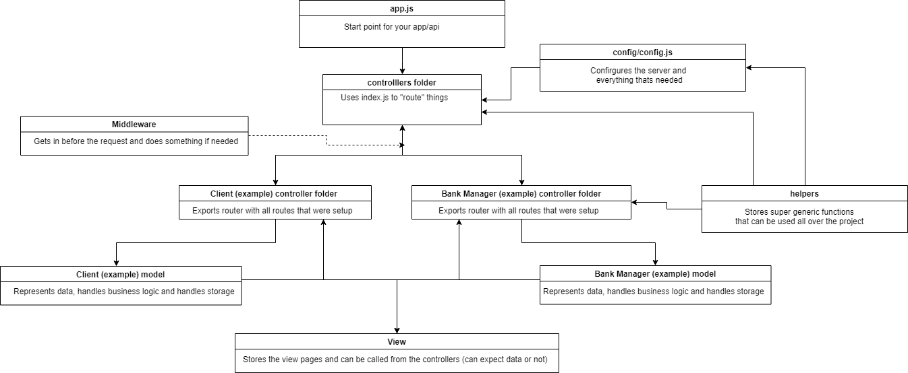

# Express Example - Tutorial and Scaffolder  

The goal of this repository is to help me study a proper Express file structure and speedup my process when creating a new server/app.

Examples, tips and shot explanations will be given throughout this repository by means of readme's. If you'd like to just clone my boilerplate project use this repo [boilerplate repository](https://github.com/LuisTessaro/Express-Example/tree/boilerplate).

## Structure represented as image

To be able do really understand this image, your will probably need to open the repo folders and read further into the readmes.


## Basic example

The following will be the barebones needed for you to setup a Express app. If you intend to do anything bigger than 3 or 4 dynamic pages and with a similar amount of routes i strongly recomend using the proper structure.

```
const express = require('express')
const app = express()

app.get('/home', (req, res) => {
    res.send('This is your /home route!')
})

app.listen(3000, () => console.log('server running on port 3000'))
```

### Instanciate Express

You need to download the library first using npm on your project's root folder.

```
npm i express
```

After that's done, you must require into your project and then make an instance of express (app). We will be using this instance for everything related to our express app.

```
const express = require('express')
const app = express()
```

### Start your server

```
const port = 3000
app.listen(port, () => console.log('server running on port', port))
```

### Setup routes on your express server

The thing that comes imediately after our Express instance (app) its the http method we are using, then the "name" of the route we will be using followed by the callback once we get a request, req (request) contains the request data sent by our clients or front end and res (response) contains our response methods (send, render, redirect etc).

```
app.get('/home', (req, res) => {
    res.send('This is your /home route!')
})
```

### Setting up a view engine

But first, what are view engines? 
View engines are responsible for rendering your pages in the browser, basically they help you deliver non static html from your express routes.

##### Setting up

```
app.set('view engine', 'hbs')
```

##### Using it to render something

Where the first argument is the name of the file of your view engine and the second is everything you want to pass to your page.

```
res.render('index', 
    {
        title "Weather APP",
        name "Luís"
    })
```

### How to setup 404's

The character * is a wild card in express, it represents anything.
You can also setup expecific 404's by using /route/ * /route/ *

```
app.use('/help/*', (req, res) => {
    res.status('404').send('404 help')
})

app.use('*', (req, res) => {
    res.status('404').send('404')
})
```